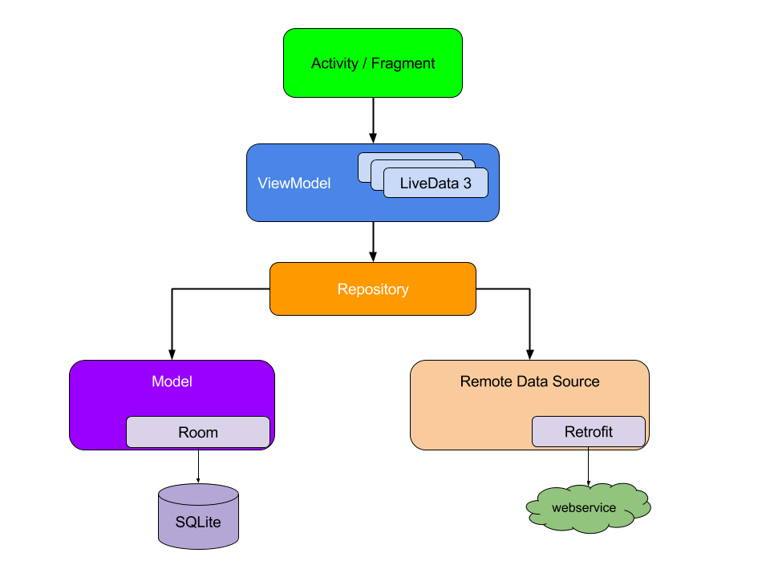

# BattlegroundStats App

This is an Android application designed to provide users with access to their in-game statistics and recent matches in PlayerUnknown's Battlegrounds (PUBG)

### Demo

    

### Architecture

This app has been build using clean architecture, follows the MVVM (Model-View-ViewModel) architectural pattern and data-caching using a repository to fetch local or remote data.

### Api Service

[PUBG Developer Portal](https://developer.pubg.com/)

### Getting started

To get started with app, follow these steps:

1. Clone the Repository.
2. Set up api key: You will need to obtain Api key for the PUBG API and add it to the app. Replace **'YOUR_API_KEY'** in the **'gradle.properties'** file with your actual API key.
3. Build and run.

### Features

* **User Authentication**: Users can log in with their PUBG account credentials to access their personalized statistics.
* **Player Stats**: View detailed statistics about your PUBG gameplay, including kills, wins losses, K/D, and more.
* **Recent Matches**: Access a list of your recent PUBG matches, complete with match details scores and rankings.

### Built with

* **ViewModel** - A class designed to store and manae UI-related data in a lifecycle conscious way.
* **LiveData** - An observable data holder class.
* **Coroutines** - A coroutine is a concurrency design pattern that you can use on Android to simplify code that executes asynchronously.
* **Retrofit** - Type-safe HTTP client for Android and Java by Square, Inc.
* **Gson** - Java library that can be used to convert Java Objects into their JSON representation.
* **Jetpack Navigation** - A library that can manage complex navigation, transition animation, deep linking, and compile-time checked argument passing between the screens in your app.
* **Koin** - Koin is a pragmatic lightweight dependency injection framework for Kotlin developers
* **Room** - An abstraction layer over SQLite to allow fluent database access while harnessing the full power of SQLite.
